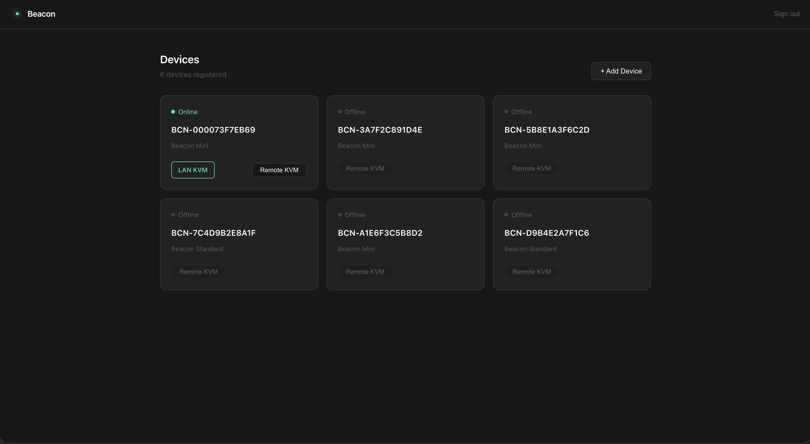

## Beacon KVM

Beacon is an IP KVM. It gives you the screen, keyboard and mouse of a computer
in a browser, over your local network or over the internet.

It is a small device that connects to that computer the way a monitor and a
keyboard do: HDMI in, USB out. Nothing is installed on the computer being
controlled, and it needs no software, no driver and no account of its own.
Beacon has its own network connection, so it is still reachable when the
machine it is attached to is not — during a restart, in firmware setup, at a
recovery prompt, or after an update that stopped it booting.

Remote sessions are relayed through an outbound connection from the device, so
there is nothing to open on a router and no VPN to configure.

### Articles

Openings of the articles on beacon-kvm.com, each linking to the full text.

| | |
|---|---|
| [IP KVM vs remote desktop](../article/ip-kvm-vs-remote-desktop.md) | What each one can reach, and which you actually need |
| [Compared with PiKVM, JetKVM and TinyPilot](../article/ip-kvm-comparison.md) | Four IP KVMs side by side, including the row where we are behind |
| [A remote machine won't boot](../article/server-wont-boot-remote.md) | What you can still do without driving there |
| [What one onsite visit actually costs](../article/cost-of-an-onsite-visit.md) | Run your own numbers; one avoided trip usually pays for the hardware |
| [An IP KVM for a homelab](../article/homelab.md) | Nothing in a homelab has a BMC |
| [How to access a computer's BIOS remotely](../article/access-bios-remotely.md) | Why none of the tools you already have can get you there |
| [A Raspberry Pi KVM, or a Beacon device](../article/raspberry-pi-or-a-beacon-device.md) | The same software; what the hardware decides |

[All articles →](../article/README.md)

### Articles

| | |
|---|---|
| [IP KVM vs remote desktop: when you need hardware](https://beacon-kvm.com/blogs/use-cases/ip-kvm-vs-remote-desktop) | RDP, VNC, TeamViewer and AnyDesk run inside the operating system |
| [Beacon KVM compared with PiKVM, JetKVM and TinyPilot](https://beacon-kvm.com/blogs/use-cases/ip-kvm-comparison) | An honest comparison of four IP KVMs — price, remote access, video, ports and power control |
| [A remote machine won't boot. Now what?](https://beacon-kvm.com/blogs/use-cases/server-wont-boot-remote) | When a server or PC at another site stops booting, remote access dies with it |
| [What one onsite visit actually costs](https://beacon-kvm.com/blogs/use-cases/cost-of-an-onsite-visit) | A truck roll to fix a machine costs far more than the drive |
| [An IP KVM for a homelab](https://beacon-kvm.com/blogs/use-cases/homelab) | Homelab machines have no IPMI, live in a cupboard, and break at the worst moment |
| [How to access a computer's BIOS remotely](https://beacon-kvm.com/blogs/use-cases/access-bios-remotely) | Remote desktop tools stop at the login screen |
| [A Raspberry Pi KVM, or a Beacon device](https://beacon-kvm.com/blogs/use-cases/raspberry-pi-or-a-beacon-device) | The same software runs on a Raspberry Pi 4B you assemble yourself and on the Beacon Device we build |

### Repositories

| | |
|---|---|
| [KVM](https://github.com/BeaconBeacon/KVM) | The trial build for a Raspberry Pi 4B: install package, releases, and the issue tracker for it |

### Elsewhere

| | |
|---|---|
| [beacon-kvm.com](https://beacon-kvm.com) | Product information, specifications and pricing |
| [doc.beacon-kvm.com](https://doc.beacon-kvm.com) | Documentation |
| [console.beacon-kvm.com](https://console.beacon-kvm.com) | Sign in and open a device |
| [YouTube](https://www.youtube.com/@beaconkvm) | Demonstrations and build notes |
| [Discord](https://discord.gg/jjXN7H6WcH) | Questions, and whatever anybody is stuck on |
| support@beacon-kvm.com | Enquiries and support |
